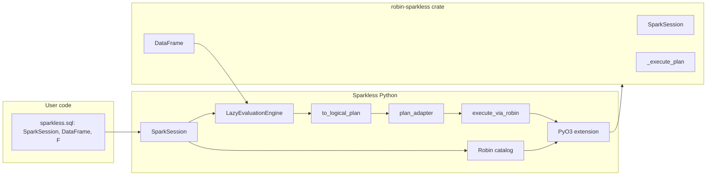

# Complete Overhaul: Robin via PyO3 Only, No Backend/Materializer (v4)

**Summary:** Overhaul Sparkless to use the robin-sparkless Rust crate via PyO3 only (no robin-sparkless Python package). Build a native extension that wraps the crate; remove backend and materializer abstractions; execution and catalog use this extension; delete all non-Robin code paths.

---

## Principle: PyO3, not the Python package

Sparkless v4 uses the **robin-sparkless Rust crate** ([crates.io](https://crates.io/crates/robin-sparkless), [GitHub](https://github.com/eddiethedean/robin-sparkless)) as its only execution engine. Integration is via **PyO3**: Sparkless builds a **native Python extension** that depends on the crate and exposes the Robin API to Python. We do **not** depend on or use the separate **robin-sparkless Python package** (the one published on PyPI and built with maturin from the same repo). The crate is compiled into Sparkless; there is no `pip install robin-sparkless` or `import robin_sparkless` in the runtime path.

---

## Current state (to remove)

- **Backend abstraction:** [sparkless/config.py](sparkless/config.py) and [sparkless/backend/factory.py](sparkless/backend/factory.py) choose a backend (polars, robin, duckdb, memory, file) and create a storage backend, materializer, and export backend. Session holds `_storage` and gets a materializer from the factory when materializing.
- **Materializer abstraction:** [sparkless/backend/protocols.py](sparkless/backend/protocols.py) defines `DataMaterializer`. [sparkless/dataframe/lazy.py](sparkless/dataframe/lazy.py) calls `BackendFactory.create_materializer(backend_type)` then `materializer.materialize(...)` or `materialize_from_plan(...)`.
- **Storage abstraction:** Session takes a `StorageBackend` (IStorageManager); factory creates Polars or Robin storage. Robin storage currently delegates catalog to Polars.
- **Robin today:** Logic under [sparkless/backend/robin/](sparkless/backend/robin/) (materializer, storage, export) uses the **robin-sparkless Python package** when `backend_type="robin"`. That package is a separate install; we are replacing this with a PyO3-built extension that wraps the **Rust crate** directly.

**Robin crate (Rust):** Provides `SparkSession`, `DataFrame`, `Column`, `lit`, `col`, optional SQL/catalog, and `_execute_plan(data, schema, plan_json)`. Plan format: [LOGICAL_PLAN_FORMAT](https://robin-sparkless.readthedocs.io/en/latest/LOGICAL_PLAN_FORMAT/). The crate already has PyO3 bindings in its own repo; we will either (a) add a Rust extension inside the Sparkless repo that depends on the crate and re-exposes the same API, or (b) vendor/inline the crate and build a single extension. Either way, Sparkless never imports the standalone `robin_sparkless` Python module.

---

## Target architecture

No backend or materializer concepts. Sparkless uses Robin only, through a PyO3-built extension.

- **User-facing API:** Unchanged (`from sparkless.sql import SparkSession, functions as F`).
- **PyO3 extension:** A native module (e.g. `sparkless._robin` or `sparkless._native`) built with **maturin** and **PyO3**. The Sparkless project (or a Rust subdirectory within it) has a `Cargo.toml` that depends on the **robin-sparkless** crate. The extension exposes to Python: `SparkSession` (builder, get_or_create), `create_dataframe_from_rows` (or equivalent), `_execute_plan`, `collect`, and any catalog/SQL APIs (e.g. `create_or_replace_temp_view`, `table`, `sql` if the crate has the `sql` feature). Optional crate features (`sql`, `delta`) can be enabled in the extension's dependency so Sparkless can use them. **No** dependency on the robin-sparkless PyPI package; the crate is the only source of Robin code.
- **Build:** `pyproject.toml` uses a build backend that builds the extension (e.g. maturin). Installing Sparkless (e.g. `pip install .` or `pip install sparkless`) compiles the Rust extension; users need a Rust toolchain for source installs, or consume pre-built wheels. CI and release build the extension for supported platforms.
- **SparkSession:** Holds the Robin session object **from the PyO3 extension** (e.g. `sparkless._robin.SparkSession.builder().app_name(...).get_or_create()`) and a **catalog** that delegates to that session (temp views, `table()`, `saveAsTable`). No backend_type, no storage_backend, no factory.
- **Execution:** When a DataFrame must be materialized, the lazy engine calls a single execution path: build logical plan → adapt to Robin format → call the extension's `_execute_plan` (or, if unsupported, apply operations via the extension's DataFrame API step-by-step). This lives in one module (e.g. `sparkless/robin/execution.py` or `sparkless/execution.py`). No DataMaterializer, no factory.
- **Catalog:** One concrete catalog that uses the Robin session (from the extension) for temp views and tables. No IStorageManager or pluggable backends.

---

## Implementation plan

### 0. PyO3 extension and robin-sparkless crate

- **Add Rust extension to Sparkless:** Introduce a PyO3 extension that wraps the robin-sparkless crate. Options:
  - **A. In-repo Rust package:** Add a directory (e.g. `rust/` or `sparkless-rs/`) with `Cargo.toml` depending on `robin-sparkless = "x.y"` (and optional features `sql`, `delta`). Implement a minimal PyO3 module that re-exports or wraps the crate's Python-facing types and functions (SparkSession, create_dataframe_from_rows, _execute_plan, etc.). Build this as part of Sparkless (maturin builds it as the package's extension). The resulting native module is imported as `sparkless._robin` (or similar) from Python.
  - **B. Inline/vendor crate:** If preferred, vendor the robin-sparkless crate into the repo and build a single extension; the plan below assumes A (dependency on the published crate) unless otherwise noted.
- **Build system:** Configure [pyproject.toml](../pyproject.toml) for maturin (or equivalent): e.g. `[build-system]` with `maturin`, `[tool.maturin]` for module name and Python binding. Ensure the extension is built on `pip install .` and that wheel builds produce the native module for target platforms.
- **Python entry point:** From Sparkless Python code, the Robin session and execution are obtained only by importing the extension (e.g. `from sparkless._robin import SparkSession as RobinSession` or a small wrapper in `sparkless/robin/execution.py` that imports from `sparkless._robin`). No `import robin_sparkless` anywhere.
- **Crate API surface:** Expose at least: SparkSession (builder, get_or_create), create_dataframe_from_rows (or _create_dataframe_from_rows), _execute_plan(data, schema, plan_json), DataFrame.collect(), and any catalog/SQL methods Sparkless needs. If the crate exposes `supported_plan_operations()`, expose that too for the execution layer to decide plan vs op-by-op.

### 1. Remove backend and materializer abstractions

- **Delete** [sparkless/backend/factory.py](../sparkless/backend/factory.py). No code path creates a backend or materializer by type.
- **Remove backend/config** from [sparkless/config.py](../sparkless/config.py): drop `DEFAULT_BACKEND`, `ENV_BACKEND_KEY`, `resolve_backend_type()`. No backend selection.
- **Session** [sparkless/session/core/session.py](../sparkless/session/core/session.py): Stop accepting `backend_type`, `storage_backend`, or any backend-related arguments. Session constructs and holds:
  - A **Robin session** from the PyO3 extension (e.g. `sparkless._robin.SparkSession.builder().app_name(...).get_or_create()`).
  - A **catalog** that delegates to that Robin session (create_temp_view, table(), saveAsTable, etc.). Session has `_robin_session` and `_catalog`; no `_storage` from a factory.
- **Lazy engine** [sparkless/dataframe/lazy.py](../sparkless/dataframe/lazy.py): Remove all use of BackendFactory and DataMaterializer. When materialization is needed, call the single execution module (see §2) with (data, schema, operations) or (data, schema, logical_plan); no "get materializer," no "can_handle_operations."
- **Protocols** [sparkless/backend/protocols.py](../sparkless/backend/protocols.py): Remove DataMaterializer, StorageBackend (and QueryExecutor/ExportBackend if backend-only). Delete the file or keep only interfaces still needed elsewhere.

### 2. Single execution path (no materializer)

- **New module** e.g. [sparkless/robin/execution.py](../sparkless/robin/execution.py) (or [sparkless/execution.py](../sparkless/execution.py)):
  - **Plan adapter:** `adapt_plan_to_robin(logical_plan, schema)` → Robin-format plan (expression trees, schema as `[{name, type}]`). Use [sparkless/dataframe/logical_plan.py](../sparkless/dataframe/logical_plan.py) (`to_logical_plan`, `serialize_expression`, `serialize_schema`) and convert to the crate's format per [LOGICAL_PLAN_FORMAT](https://robin-sparkless.readthedocs.io/en/latest/LOGICAL_PLAN_FORMAT/).
  - **Execute via plan:** `execute_plan(data, schema, logical_plan, robin_session)` → build Robin schema + plan_json, call the **extension's** `_execute_plan(data, schema, plan_json)` (the session or module from `sparkless._robin`), collect result, convert to `List[Row]`. Use the extension's `supported_plan_operations()` if available to decide plan vs op-by-op; otherwise try plan and fall back on failure.
  - **Execute op-by-op:** `execute_operations(data, schema, operations, robin_session)` → create Robin DataFrame via the extension's create_dataframe_from_rows, apply each operation via the extension's DataFrame API (filter, select, with_column, join, etc.), return collected rows. Move translation logic from [sparkless/backend/robin/materializer.py](../sparkless/backend/robin/materializer.py) into this module (expression/filter/join helpers); then delete the materializer.
- **Lazy engine** calls this execution module only (e.g. try `execute_plan`; on unsupported plan, call `execute_operations`). No protocol, no factory. All calls go to the PyO3 extension, not to any `robin_sparkless` Python package.

### 3. Catalog only (no storage backend abstraction)

- **Single catalog** that uses the Robin session from the PyO3 extension: e.g. [sparkless/robin/catalog.py](../sparkless/robin/catalog.py) or [sparkless/catalog.py](../sparkless/catalog.py). Implements create_temp_view, table(), saveAsTable, tableExists, list_tables, etc. by calling the extension's session API. No Polars; no IStorageManager.
- **Remove** [sparkless/backend/robin/storage.py](../sparkless/backend/robin/storage.py) and any Polars delegation. SQL/catalog code paths use the new catalog only.

### 4. SQL and Delta

- **SQL:** Delegate `spark.sql()` to the Robin session from the extension when the crate's `sql` feature is enabled; wrap the returned Robin DataFrame in a Sparkless DataFrame. For DDL/DML the crate does not support, keep the existing Python SQL executor operating on the concrete catalog.
- **Delta:** Delegate Delta read/write to the extension's API when the crate's `delta` feature is enabled; otherwise keep Python-side Delta logic using the Robin-backed catalog/paths.

### 5. Remove all non-Robin code and backend package

- **Delete** the entire [sparkless/backend/](../sparkless/backend/) package (factory, protocols, polars, duckdb, robin materializer/storage/export). Execution and catalog logic live in the new layout (§0–3); no "backend" or "materializer" naming.
- **Storage backends:** Remove or repurpose [sparkless/storage/backends/memory.py](../sparkless/storage/backends/memory.py) and [sparkless/storage/backends/file.py](../sparkless/storage/backends/file.py) so session/catalog never use them. Delete [sparkless/storage/manager.py](../sparkless/storage/manager.py) if it only supported multiple backends.
- **Dependencies:** In [pyproject.toml](../pyproject.toml): **Do not** add the robin-sparkless **Python** package. The Rust extension depends on the **robin-sparkless crate** (Cargo.toml). Remove Polars and other backend-only Python deps unless still needed for non-execution code. Remove `[robin]` and other backend extras. Build dependency: maturin (and Rust toolchain for source builds).

### 6. Types and API boundary

- **Keep Sparkless types** for the public API (`StructType`, `StructField`, `Row`, etc.). At the boundary to the extension: Sparkless schema → Robin schema format; Sparkless rows → list of dicts for `_execute_plan`; extension's `collect()` → Sparkless `Row` list.
- **Session and builder:** Same user-facing API (`SparkSession.builder().config(...).getOrCreate()`). Session holds only the Robin session (from the extension) and the concrete catalog. Remove `spark.sparkless.backend` and any backend-related config.

### 7. Testing and CI

- **Tests:** Full suite runs with Robin only (via the PyO3 extension). Remove or rewrite tests that referenced backends, factory, or materializer. Fix or skip tests that assumed Polars; document unsupported ops in a "Robin gaps" list.
- **CI:** Build the extension (maturin); run tests. CI must have Rust toolchain and maturin. No job that installs or uses the robin-sparkless Python package. If the crate supports multiprocessing configuration (e.g. for pytest-xdist), call it from [tests/conftest.py](../tests/conftest.py).

### 8. Documentation and release

- **README and docs:** v4 runs on Robin only via a **PyO3 extension** that wraps the robin-sparkless **Rust crate**; we do **not** use the robin-sparkless Python package. Installation: `pip install sparkless` (builds or uses pre-built wheels containing the extension). Document that source installs require Rust and maturin. Link to the crate's API and plan format; document gaps vs v3.
- **Changelog:** v4.0.0: Robin-only execution via PyO3 (robin-sparkless crate); no robin-sparkless Python package; backend and materializer removed; single execution path and catalog; breaking changes and migration notes.

---

## Process: Robin feature gaps & PySpark parity

Robin is the **only** execution engine in v4, and PySpark parity is a hard requirement. When you hit a behavior gap, follow this flow:

1. **Always verify against PySpark first**
   - Reduce the failing Sparkless test to a **minimal example**.
   - Run the same logic against a real PySpark session (matching our supported versions).
   - Confirm that **Sparkless+Robin** and **PySpark** disagree in behavior or results.

2. **Decide where the gap lives**
   - If Sparkless is clearly mis-translating plans / expressions or misusing the Robin API, fix Sparkless.
   - If Sparkless is correctly asking for the PySpark behavior but the **robin-sparkless crate** produces a different result than PySpark, treat this as a **Robin parity issue**.

3. **File an upstream issue in robin-sparkless**
   - Open an issue in [eddiethedean/robin-sparkless](https://github.com/eddiethedean/robin-sparkless) with:
     - A clear **title** mentioning “PySpark parity” and the affected area (e.g. “PySpark parity: regexp_extract_all + select”).
     - A **minimal reproducible example** that:
       - Shows the behavior using the **robin-sparkless crate or its Python bindings**.
       - Shows the **equivalent PySpark code** and its output.
     - Environment details (crate version, PySpark version, platform).
     - A short note that this blocks Sparkless parity in v4 (link to any Sparkless GitHub issue if it exists).

4. **Track the gap on the Sparkless side**
   - Keep a “Robin gaps” list in Sparkless (docs or issues) and link to the upstream robin-sparkless issue.
   - In Sparkless tests / docs, clearly mark these as **known Robin parity gaps** until the upstream fix lands.

This process is **not optional**: for any observed PySpark/Sparkless difference, we must first prove that PySpark behaves differently, and then, when the root cause is in the Robin crate, file (and link to) a proper upstream issue demonstrating *robin-sparkless vs PySpark* behavior.

---

## Risks and mitigations

- **Robin coverage:** Not every operation may be supported by the crate. Use the extension's `supported_plan_operations()` (if exposed) and the op-by-op path for unsupported plans; document gaps and required crate version.
- **Plan format drift:** Keep the plan adapter in one module; add round-trip tests (Sparkless plan → adapter → extension `_execute_plan`).
- **Build complexity:** PyO3 and Rust add a build dependency (Rust toolchain, maturin). Mitigation: document clearly; provide wheels for common platforms so most users do not need to compile; CI builds the extension.
- **Breaking changes:** v4 is Robin-only via PyO3; no robin-sparkless Python package; backend and materializer removed. Major version 4.0.0; release notes and migration guide.

---

## Suggested phase order

1. **Phase 0 – PyO3 extension**
   Add the Rust/PyO3 extension that depends on the robin-sparkless crate and exposes SparkSession, create_dataframe_from_rows, _execute_plan, collect, and any needed catalog APIs. Configure pyproject.toml for maturin. Ensure `import sparkless._robin` (or chosen name) works after `pip install -e .`. No use of the robin-sparkless Python package anywhere.
2. **Phase 1 – Execution and plan adapter**
   Add [sparkless/robin/execution.py](../sparkless/robin/execution.py) (or [sparkless/execution.py](../sparkless/execution.py)) with plan adapter, `execute_plan`, and `execute_operations`, calling only the PyO3 extension. Update [sparkless/dataframe/lazy.py](../sparkless/dataframe/lazy.py) to call this module instead of BackendFactory/materializer. Keep the existing backend package temporarily so tests can run during transition.
3. **Phase 2 – Catalog and session**
   Implement the single catalog that uses the Robin session from the extension. Refactor [sparkless/session/core/session.py](../sparkless/session/core/session.py) to hold that session and this catalog; remove backend_type, storage_backend, and factory. Remove backend-related config from config.py and builder.
4. **Phase 3 – Remove backend package and old code**
   Delete [sparkless/backend/](../sparkless/backend/) and repurpose or remove storage/backends and storage/manager. Update pyproject.toml (no robin-sparkless Python dep; extension depends on crate). Fix all imports.
5. **Phase 4 – SQL, Delta, tests, docs**
   Wire spark.sql() and Delta to the extension. Run full test suite; remove or adapt backend/materializer tests. Update README and changelog. Release v4.0.0.
