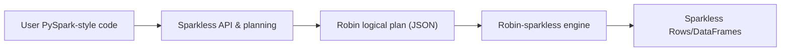

# Sparkless v4 Roadmap

## 1. Introduction & Objectives

Sparkless v4.0.0 is intended to **simplify the architecture and concentrate execution in a single engine**, while preserving Sparkless’s role as a fast, PySpark-compatible test and development environment. The primary goal is to make Sparkless a **thin, robust wrapper over Robin-sparkless**, reducing duplicated execution logic and focusing this repository on the Python-facing API, planning, and compatibility story.

This document is a **maintainer-facing roadmap and design direction**, not a binding specification or release plan. It summarizes the desired technical direction, highlights key decisions and trade-offs, and collects open questions that must be resolved before finalizing a v4 release scope.

## 2. Current State (Sparkless v3.x)

Sparkless v3.x exposes a **PySpark-like public API** (`sparkless.sql.SparkSession`, `DataFrame`, `functions as F`, `types`, window functions, SQL, Delta helpers) backed by a **lazy DataFrame layer** and a **pluggable backend architecture**.

At a high level:

- Sparkless owns:
  - Public modules and imports (`sparkless.sql`, `sparkless.functions`, `sparkless.types`, window APIs, exceptions).
  - The lazy `DataFrame` abstraction, which maintains a queue of operations to be materialized.
  - A logical plan / operations format used by the Polars backend and some internal tooling.
- Execution is delegated to one of several **backends**:
  - Polars backend (default, thread-safe).
  - Memory / file backends.
  - Optional Robin backend, which can execute via `robin_sparkless`.

Today, the **Robin backend** integrates by translating Sparkless `Column` trees and operations into Robin `DataFrame` calls on a per-operation basis. Sparkless and Robin-sparkless already share a substantial parity suite and fixtures, but they do not yet share a single, stable logical plan representation.

For more detail, see:

- `[docs/backend_architecture.md](backend_architecture.md)`
- `[docs/backend_selection.md](backend_selection.md)`
- `[docs/sparkless_v4_robin_research.md](sparkless_v4_robin_research.md)`
- `[docs/internal/logical_plan_format.md](internal/logical_plan_format.md)`

## 3. Target v4 Architecture (High-Level)

The v4 direction assumes a **single-backend architecture** where Sparkless is the **front-end** and Robin-sparkless is the **only execution engine**:

- **Sparkless (front-end)**
  - Owns the Python-facing API surface: `SparkSession`, `DataFrame`, `functions as F`, windowing, types, and exceptions.
  - Builds and manages a lazy **logical plan** (or equivalent operation list) for each `DataFrame`.
  - Enforces PySpark-compatibility rules at the API and planning layers where necessary.
- **Robin-sparkless (engine)**
  - Executes all query and expression logic: filters, projections, joins, groupBy/agg, windows, and built-in functions.
  - Owns the expression language and type system used at execution time.
  - Provides a stable, versioned **plan interpreter** entry point for Sparkless.

At a high level, actions on a Sparkless `DataFrame` (e.g. `collect`, `count`, `show`) become:

The intent is to converge on **“one front-end, one engine, one execution path”** for Sparkless, while retaining enough control at the Sparkless layer to maintain PySpark compatibility and a predictable upgrade path.

## 4. Plan & Ownership of the Logical Plan

Sparkless and Robin-sparkless both already use logical plans internally:

- Sparkless has:
  - A lazy operations queue attached to each `DataFrame`.
  - Internal documentation of a logical plan format (`docs/internal/logical_plan_format.md`).
- Robin-sparkless has:
  - A JSON-based plan representation (list of operations plus JSON-encoded expressions).
  - A Rust interpreter that executes such plans over Robin `DataFrame`s.

There are two main options for v4:

- **Option A – Sparkless-internal plan + adapter**
  - Sparkless continues to own its own internal logical plan representation.
  - A thin adapter converts this plan into Robin’s JSON plan format at the delegation boundary.
  - Robin’s plan format is treated as a **public execution contract** between the projects.
- **Option B – Adopt Robin’s plan format directly**
  - Sparkless adopts Robin’s JSON plan format as its own logical plan representation.
  - The adapter step disappears; Sparkless plans are natively “Robin plans”.
  - Tighter coupling: changes to Robin’s plan format directly affect Sparkless.

### Preferred direction (v4)

For v4, the **preferred direction is Option B**:

- Sparkless adopts Robin’s JSON plan format as the canonical logical plan representation.
- The Sparkless planner builds Robin-native plans directly, avoiding a separate adapter layer and reducing duplication between the two projects.
- This makes Robin’s plan format the shared, explicit contract and focuses Sparkless work on API semantics, plan construction, and compatibility, rather than maintaining a distinct internal plan dialect.

Option A remains a conceptual fallback if adopting Robin’s plan format proves too constraining in practice, but the working assumption for v4 is that Sparkless will converge on Robin’s plan format as its internal representation.

### Versioning and compatibility

Regardless of which option ultimately wins:

- The **plan contract between Sparkless and Robin-sparkless must be versioned and documented**.
- Sparkless v4 should explicitly declare which Robin-sparkless versions and which plan format versions it supports.
- Breaking changes to the plan format in Robin should be treated like breaking API changes and coordinated with Sparkless.

## 5. Execution Path & Responsibilities Split

In a Robin-only world, responsibilities are split as follows:

- **Sparkless responsibilities**
  - Public PySpark-compatible API surface.
  - Session lifecycle: `SparkSession.builder`, `SparkSession.sql`, catalog/context wiring where it affects user-facing behavior.
  - DataFrame construction, lazy operation recording, and logical planning.
  - Configuration surface (e.g. `spark.sparkless.*`), including Robin-related options.
  - Compatibility shims for PySpark behavior where necessary (e.g. error classes, minor type differences).
- **Robin-sparkless responsibilities**
  - Data storage and execution for tables handled by the engine.
  - Execution of filters, projections, joins, groupBy/agg, window functions, and all registered functions.
  - Expression evaluation semantics and type system at execution time.
  - Performance characteristics (parallelism, optimizations inside the engine).

Some subsystems may remain primarily in Sparkless for backwards-compatibility or ergonomics reasons, such as:

- Catalog & persistence behavior that is already relied upon in Sparkless-only environments.
- Parts of SQL parsing and high-level query validation where Sparkless exposes specific behavior or error messages.

Assumptions for v4:

- Sparkless v4 is **Robin-only** for execution; there is no runtime backend selection between Polars, DuckDB, etc.
- Robin-sparkless becomes a **required dependency** for v4 (subject to an acceptable installation and packaging story).

## 6. Backwards Compatibility & Migration

The intended compatibility story has two dimensions:

- **PySpark compatibility**: continue to track PySpark semantics closely, using parity tests and fixtures as the ground truth wherever practical.
- **Sparkless v3 → v4 migration**: provide a predictable upgrade path for existing Sparkless users.

High-level goals:

- Preserve existing v3 behavior where possible, especially for:
  - Public APIs (`SparkSession`, `DataFrame` methods, functions, types, window definitions).
  - Error classes and common error messages.
  - SQL behavior for common operations.
- Where Robin’s behavior differs and Sparkless cannot or should not fully hide the difference:
  - Prefer to **document and test** the new behavior rather than silently changing it.
  - Consider targeted compatibility shims for the most user-visible cases.

### Migration steps (conceptual)

The v4 migration toward a Robin-only engine is expected to include:

- **Deprecation of multi-backend configuration**
  - Mark `SPARKLESS_BACKEND` / `spark.sparkless.backend` as deprecated in favor of Robin-only configuration.
  - Route configuration surfaces toward Robin-oriented options (e.g. engine tuning, resource limits), where appropriate.
- **Test suite migration**
  - Ensure the existing parity and unit test suites run against the Robin-backed execution path exclusively.
  - Where tests currently depend on Polars- or backend-specific quirks, either:
    - Update expectations to match the Robin engine, or
    - Introduce explicit compatibility layers where the v3 behavior is important to preserve.
- **Behavioral change documentation**
  - Maintain a **v3 → v4 migration guide** that lists:
    - Intentional behavior changes.
    - Known differences introduced by Robin semantics.
    - Configuration flags that have been removed or repurposed.

## 7. Milestones & Workstreams (No Dates)

This section breaks v4 work into **workstreams** with qualitative entry/exit criteria. It is intentionally free of calendar dates.

### 7.1 Plan/Adapter Implementation & Stabilization

- **Scope**
  - Adopt Robin’s JSON logical plan format as the canonical plan representation within Sparkless.
  - Ensure the Sparkless planner can construct Robin-compatible plans for the subset of operations exercised by existing tests.
  - Integrate with a Robin plan interpreter entry point (e.g. `_execute_plan(data, schema, plan_json)`).
- **Entry criteria**
  - Agreement that Robin’s plan format is the authoritative logical plan dialect for Sparkless v4.
  - Documented minimal plan/operation set in Robin’s format to support the existing parity suite.
- **Completion criteria**
  - All existing parity and unit tests can execute via the Robin plan interpreter.
  - Plan construction and execution paths have targeted tests and logging for debugging.

#### 7.1.1 Phase 1 implementation status

- [x] Robin plan format contract documented in `docs/internal/robin_plan_contract.md`.
- [x] Robin-format plan builder implemented in `sparkless/dataframe/robin_plan.py` (filter, select, withColumn, orderBy, and simple ops); unsupported operations and expressions raise `ValueError` to trigger fallback.
- [x] `RobinMaterializer.materialize_from_plan` stub added in `sparkless/backend/robin/materializer.py` to establish the plan-based API and allow the lazy engine to attempt the plan path for backend_type `robin` while still falling back to the operation-based path.
- [x] Lazy engine updated in `sparkless/dataframe/lazy.py` to use `to_robin_plan` when backend_type is `robin` and a `materialize_from_plan` method is present.
- [x] Initial unit tests for the Robin plan builder added in `tests/unit/dataframe/test_robin_plan.py` to validate structure and JSON-serializability.
- [ ] Robin backend wired to a concrete Robin plan execution API (e.g. `_execute_plan`) and exercised in parity/integration tests (pending Robin-sparkless plan executor exposure and alignment).

### 7.2 Backend Simplification (Removing Non-Robin Backends)

- **Scope**
  - Retire or significantly simplify the legacy backend abstraction in favor of Robin as the only engine.
  - Remove unused/obsolete backends (Polars-only executor paths, DuckDB, etc.), or gate them behind explicit legacy flags if needed temporarily.
- **Entry criteria**
  - Robin-backed path is green for the vast majority of tests.
  - A migration guide draft outlines what changes users should expect.
- **Completion criteria**
  - No runtime configuration paths remain for selecting non-Robin backends in v4 default builds.
  - Documentation and examples reflect Robin-only execution.

#### 7.2.1 Phase 2 implementation status

- [x] Default backend and config set to Robin (`config.py`, session docstring).
- [x] BackendFactory only creates Robin backends; `list_available_backends()` returns `["robin"]`; other backend types raise `ValueError`.
- [x] Robin storage no longer delegates to Polars; uses file-based storage (`FileStorageManager`) for catalog/table persistence.
- [x] Storage package and writer/reader updated: no Polars imports; `RobinStorageManager` and `create_robin_manager` in storage; writer/reader use row-based and pandas (where needed) for file I/O; Robin export uses row-based export (no Polars).
- [x] Migration guide draft added (`docs/migration_v3_to_v4.md`); README, `backend_selection.md`, `configuration.md` updated for Robin-only.
- [x] Tests and CI: default backend is Robin; `test_robin_optional` updated for v4 (list_available_backends returns `["robin"]` only); tests that set/assert `backend_type="polars"` updated to `robin`; three infer-schema CSV tests skipped (v4 string-only inference, Phase 3 gap). Some unit tests still fail with Robin due to unsupported operations (e.g. select, substr, cast)—documented as Phase 3 compatibility layer scope.

### 7.3 Compatibility Layer & Parity Validation

- **Scope**
  - Identify remaining behavioral differences between v3 and the Robin-backed v4.
  - Decide case-by-case whether to:
    - Add compatibility shims in Sparkless, or
    - Accept/document Robin semantics as the new behavior.
- **Entry criteria**
  - Plan/adapter layer is feature-complete for current tests.
  - Test suite has clear failure signals for differences attributable to engine semantics.
- **Completion criteria**
  - A documented list of deliberate behavior changes.
  - Parity tests reflect the agreed behavior (PySpark vs Robin vs Sparkless).

#### 7.3.1 Phase 3 implementation status

- [x] Catalog of test failures with Robin (unit + optional parity), grouped by: unsupported operation, unsupported expression, behavioral/semantic difference. See `docs/v4_behavior_changes_and_known_differences.md` and `tests/phase3_robin_unit_failures.txt`.
- [x] Documented list of deliberate behavior changes and known differences (v3 vs v4 / Robin). See `docs/v4_behavior_changes_and_known_differences.md`; migration guide updated with "Known differences and limitations" and link.
- [x] Decisions per category: shim vs accept-and-document. Unsupported select/withColumn/filter expressions, type strictness, map/array/nested rows, column case: accept and document. Error message ("Consider using a different backend (e.g. polars)"): shim to v4 message. See doc.
- [x] Compatibility shims implemented: error-message normalization in `sparkless/dataframe/lazy.py` and `sparkless/backend/robin/materializer.py` (alternative text points to docs/v4_behavior_changes_and_known_differences.md).
- [x] Parity/test updates: tests that requested polars backend updated (test_approx_count_distinct_rsd fixture uses Robin session; test_logical_plan Phase 2 config set to robin; test_polars_materialize_from_plan_simple_pipeline skipped with Phase 1 reason). Default test run uses Robin; many unit tests still fail with Robin due to unsupported operations/expressions—documented as known gaps; no bulk skip of all failing tests in Phase 3.

### 7.4 Tooling & Debugging

- **Scope**
  - Add maintainer-facing tools to:
    - Pretty-print Sparkless logical plans.
    - Dump the Robin JSON plan and results around failing tests.
    - Reproduce failing Sparkless tests as Robin-only fixtures when needed.
- **Entry criteria**
  - Early experiences debugging the Robin-backed execution path reveal pain points.
- **Completion criteria**
  - Maintainers have a repeatable workflow to understand “what Sparkless sent to Robin” and “what Robin returned” for any failing case.

#### 7.4.1 Phase 4 implementation status

- [x] Pretty-print Sparkless and Robin logical plans: `sparkless.utils.plan_debug` (`pretty_print_logical_plan`, `get_logical_plan`); doc in `docs/development/debugging_plans.md`; script `scripts/dump_plan.py`.
- [x] Dump Robin plan + input + result/error when `SPARKLESS_DEBUG_PLAN_DIR` is set: in `sparkless/dataframe/lazy.py` (Robin path); writes `run_NNN/plan.json`, `input_data.json`, `schema.json`, `result.json` or `error.txt`; dump layout documented in debugging_plans.md.
- [x] Documented workflow to reproduce a failing test from dump: section "Reproducing a failing test with Robin only" in debugging_plans.md; script `scripts/reproduce_robin_plan.py` loads dump and prints summary.
- [x] Completion: maintainers can repeatably see "what Sparkless sent to Robin" and "what Robin returned" (or the error) via env var dump and reproduce script.

### 7.5 Plan-Based Execution (Robin Plan Interpreter)

- **Scope**
  - Wire Sparkless Robin backend to a concrete plan execution API from Robin-sparkless (e.g. `execute_plan(data, schema, plan_json)` or equivalent).
  - Replace or complement the current operation-by-operation materialization path with plan-based execution when the plan is fully supported.
  - Document the contract (plan format version, supported ops) and any fallback behavior.
- **Entry criteria**
  - Robin-sparkless exposes a stable plan execution entry point that Sparkless can call.
  - Plan format and supported operations are aligned with `docs/internal/robin_plan_contract.md`.
- **Completion criteria**
  - `RobinMaterializer.materialize_from_plan` calls the Robin plan executor and returns rows (no longer raises "not yet implemented").
  - Parity or integration tests exercise the plan path; fallback to operation-based path is documented and tested where the plan does not cover an op.

#### 7.5.1 Phase 5 implementation status

- [ ] Robin-sparkless plan execution API identified and documented (entry point, args, return shape).
- [ ] `RobinMaterializer.materialize_from_plan` implemented to call Robin plan executor; fallback to operation-based path when plan is incomplete or unsupported.
- [ ] Integration or parity tests added for plan-based execution path.
- [ ] Contract and versioning notes updated in `docs/internal/robin_plan_contract.md` (or equivalent).

### 7.6 Test Suite Green & CI (Robin-Only)

- **Scope**
  - Achieve a green (or explicitly accepted) test run with Robin as the only backend.
  - Either: (a) fix or extend the engine so previously failing tests pass, or (b) formally skip or mark tests that are out of scope for v4 and document them.
  - CI runs the full suite with Robin by default; any skips or expected failures are documented and tracked.
- **Entry criteria**
  - Phase 3 catalog of failures exists; Phase 4 tooling is available for debugging.
- **Completion criteria**
  - `pytest tests/unit/ ...` (and any agreed parity subset) completes with no unexpected failures; remaining skips/failures are listed and justified (e.g. in roadmap or `v4_behavior_changes_and_known_differences.md`).
  - CI configuration (e.g. `run_all_tests.sh`, GitHub Actions) runs Robin-only and is documented.

#### 7.6.1 Phase 6 implementation status

- [ ] Full unit (and agreed parity) test run with Robin-only: all failures either fixed or explicitly skipped/marked with reference to v4 scope.
- [ ] Documented list of skipped or expected-fail tests and rationale (roadmap or `docs/v4_behavior_changes_and_known_differences.md`).
- [ ] CI runs Robin-only by default; any optional "legacy" or Polars paths documented if retained.

### 7.7 Expression & Operation Coverage (Robin Materializer)

- **Scope**
  - Extend the Robin materializer (and Robin plan builder where applicable) to support more expressions and operations used by the test suite and common PySpark patterns.
  - Prioritize: cast in select/withColumn, CaseWhen, window expressions in select, getItem, and other high-impact gaps from the Phase 3 catalog.
  - Document any remaining unsupported operations and recommend workarounds.
- **Entry criteria**
  - Test suite green or accepted (7.6); list of unsupported ops/expressions is known.
- **Completion criteria**
  - Agreed set of "in scope" operations and expressions is supported; remaining gaps are documented and optionally gated with clear errors.

#### 7.7.1 Phase 7 implementation status

- [ ] Priority operations/expressions (e.g. cast, CaseWhen, window in select, getItem) implemented or mapped to Robin equivalents.
- [ ] Plan builder and/or materializer updated; tests added or un-skipped where coverage is added.
- [ ] Remaining unsupported ops/expressions documented with workarounds or clear error messages.

### 7.8 Release Readiness (v4.0.0)

- **Scope**
  - Version and dependency alignment: pin or document supported `robin-sparkless` version(s); ensure `pyproject.toml` and install instructions are correct.
  - Changelog and release notes: summarize v3 → v4 breaking changes, migration path, and known limitations.
  - Documentation pass: README, migration guide, backend docs, and roadmap reflect the final v4 scope; remove or archive obsolete backend references.
- **Entry criteria**
  - Plan execution (7.5) and test green/acceptance (7.6) are at least in a releasable state; expression coverage (7.7) is at a level the maintainers accept for v4.
- **Completion criteria**
  - Changelog and release notes drafted; docs updated; version set to v4.0.0 (or target version); release process (tag, publish) documented or executed.

#### 7.8.1 Phase 8 implementation status

- [ ] `robin-sparkless` version requirement documented (e.g. in `pyproject.toml` and README); install verified.
- [ ] CHANGELOG and release notes drafted (v3 → v4 breaking changes, migration, known limitations).
- [ ] README, migration guide, backend/configuration docs updated; obsolete backend references removed or archived.
- [ ] Version set to v4.0.0 (or target); release steps documented or performed.

### 7.9 Optional: Reader Schema Inference & Polish

- **Scope**
  - Optional improvements for v4.0 or a follow-up patch: CSV/reader schema inference beyond string-only (e.g. numeric/boolean/date) without reintroducing Polars; any small compatibility or UX polish identified during 7.6–7.8.
- **Entry criteria**
  - v4.0 scope is otherwise complete; maintainers choose to include this in v4.0 or defer.
- **Completion criteria**
  - Agreed optional items implemented or explicitly deferred with a short rationale.

#### 7.9.1 Phase 9 implementation status

- [ ] CSV/reader schema inference (beyond string-only) evaluated; implemented or deferred with rationale.
- [ ] Any additional polish items from 7.6–7.8 tracked and completed or deferred.

## 8. Risks, Open Questions, and Decision Points

This section collects the main risks and open questions identified so far. It should be kept up to date as design discussions progress.

### 8.1 Behavioral Differences and Parity Guarantees

- How strict should the **v3 → v4 behavioral compatibility guarantee** be?
- For subtle differences (null semantics, ordering, floating-point behavior, type coercions, error messages), should Sparkless:
  - Invest in compatibility shims to match v3 / PySpark exactly, or
  - Prefer to adopt Robin semantics when the cost of shimming is high?

### 8.2 Plan Format Ownership

- Should Sparkless:
  - Treat Robin’s plan format as the canonical spec (current v4 direction)?
  - Maintain any thin, Sparkless-only abstractions around Robin’s plan format for ergonomics or testing?
- If a shared plan library emerges, how will **governance and versioning** work across the two repositories?

### 8.3 Scope of Robin Responsibilities

- How much of the stack should Robin own beyond core execution?
  - Catalog and storage semantics?
  - SQL parsing and high-level optimization?
- Which layers remain in Sparkless primarily to preserve existing behavior or to provide a constrained, test-focused environment?

### 8.4 Installation & Operational Complexity

- What is the acceptable **installation story** for Robin-sparkless as a required dependency?
- How do we support:
  - CI environments with constrained build capabilities.
  - Contributors who previously relied on a pure-Python/Polars stack.

### 8.5 Migration from Multi-Backend to Robin-Only

- How aggressively should non-Robin backends be deprecated and removed?
- Are there known users or use cases that rely on non-Robin backends that require a **longer-lived legacy path**?

## 9. Relationship to Other Docs

This roadmap is intended as a **maintainer-friendly summary and pointer hub** for Sparkless v4 architectural work. It should be read alongside more detailed design and research documents, including:

- `[docs/sparkless_v4_robin_research.md](sparkless_v4_robin_research.md)` – detailed exploration of making Sparkless a thin wrapper over Robin-sparkless, including integration strategies and risks.
- `[docs/internal/logical_plan_format.md](internal/logical_plan_format.md)` – current description of Sparkless’s internal logical plan representation.
- `[docs/internal/robin_plan_contract.md](internal/robin_plan_contract.md)` – contract for the Robin-format logical plan used by Sparkless v4 when targeting the Robin backend.
- `[docs/robin_sparkless_needs.md](robin_sparkless_needs.md)` and related Robin documents – requirements and gaps identified from the Robin engine’s perspective.
- `[docs/robin_improvement_plan.md](robin_improvement_plan.md)` and `[docs/robin_mode_*](.)` docs – prior analyses of Robin-backed execution and failure modes.
- `[docs/roadmap/3.27.1.md](roadmap/3.27.1.md)` – example of a version-specific roadmap used for v3.x.

Future updates to this document should:

- Clarify which design options have been **decided**, which remain **preferred but tentative**, and which are still **open**.
- Link to any new, more detailed v4 design specs that emerge (e.g. a dedicated logical plan contract document).

